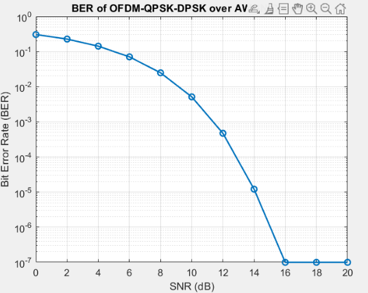
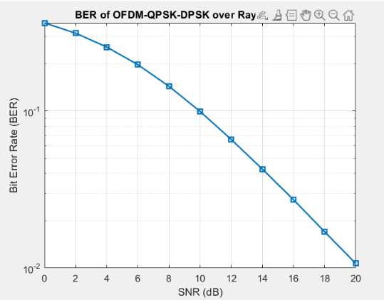
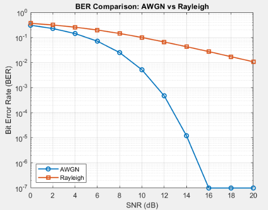

# OFDM-QPSK-DPSK over AWGN and Rayleigh Channels

This repository contains my Wireless Communications computer assignment.  
In this project, I implemented a basic OFDM transmitter/receiver chain with QPSK and DPSK, then compared the BER performance over AWGN and Rayleigh channels.

The second version of the code also uses a one-tap MMSE equalizer for the Rayleigh channel.

---

## System Overview

The simulated system follows this main chain:

```text
Random bits → QPSK mapping → Frame division → DPSK modulation
→ Subcarrier allocation → IFFT → Cyclic Prefix → Channel
→ CP removal → FFT → DPSK demodulation → QPSK decision
```

The main simulation parameters are:

| Parameter | Value |
|---|---:|
| Number of bits | `1e7` |
| Modulation | QPSK |
| Number of carriers | `400` |
| IFFT/FFT length | `1024` |
| Cyclic prefix length | `256` |
| SNR range | `0:2:20 dB` |
| Symbols per frame per carrier | `21` |

---

## Important Relations

For the project settings,

```math
sfc = \left\lceil \frac{2^{13}}{n_c} \right\rceil
```

With `nc = 400`:

```math
sfc = \left\lceil \frac{8192}{400} \right\rceil = 21
```

The QPSK symbols are mapped to phase values as

```math
s_m = e^{j\frac{2\pi}{M}m}, \qquad M=4
```

The DPSK modulation is done by accumulating the phase index along each carrier:

```math
d_{r,c} = (a_{r,c} + d_{r-1,c}) \bmod 4
```

The cyclic prefix length is

```math
N_{CP}=0.25N_{FFT}=256
```

For the AWGN channel, the noise variance is set from the SNR:

```math
\sigma_n^2 = \frac{P_x}{10^{SNR_{dB}/10}}
```

The BER is calculated as

```math
BER = \frac{\text{number of wrong bits}}{\text{total number of transmitted bits}}
```

For the Rayleigh channel in the second code, the received subcarrier model is

```math
Y_k = H_kX_k + W_k
```

and the one-tap MMSE equalizer is

```math
\hat{X}_k =
\frac{H_k^*}{|H_k|^2 + \sigma_W^2/E_s}Y_k
```

---

## Results

### AWGN Channel

<p align="center">
  
</p>

<p align="center">
  <em>Figure 1. BER of the OFDM-QPSK-DPSK system over the AWGN channel. As SNR increases, the BER drops quickly and reaches the simulation floor at high SNR.</em>
</p>

The AWGN result behaves as expected. At low SNR, the noise is strong and the BER is high. When SNR increases, the QPSK decisions become more reliable, so the BER decreases sharply.

---

### Rayleigh Channel with MMSE Equalizer

<p align="center">
  
</p>

<p align="center">
  <em>Figure 2. BER of the OFDM-QPSK-DPSK system over the Rayleigh channel using a one-tap MMSE equalizer.</em>
</p>

The Rayleigh channel is harder than AWGN because fading can strongly attenuate some symbols or subcarriers. The MMSE equalizer helps reduce the effect of fading, but the BER is still higher than the AWGN case.

---

### AWGN vs Rayleigh Comparison

<p align="center">
  
</p>

<p align="center">
  <em>Figure 3. BER comparison between AWGN and Rayleigh channels. The Rayleigh curve stays above the AWGN curve because fading adds another source of distortion besides noise.</em>
</p>

The comparison shows the main point of the simulation: even with the same SNR, the Rayleigh channel gives worse BER than AWGN because the received signal also suffers from random fading.

---

## Main Observations

- BER decreases when SNR increases.
- AWGN gives the best performance because it only adds noise.
- Rayleigh fading gives worse performance because the channel gain changes randomly.
- A one-tap MMSE equalizer improves the Rayleigh receiver compared with a receiver without channel compensation.
- At very high SNR, the AWGN curve reaches the lowest observable BER in this finite simulation.

---

## Files

```text
.
├── CA2_OFDM.m
├── CA2_OFDM_Rayleigh_EQ.m
├── README.md
└── figures
    ├── aa.png
    ├── bb.png
    └── cc.png
```

---

## Tools

- MATLAB
- OFDM simulation
- QPSK / DPSK modulation
- AWGN and Rayleigh channel modeling
- MMSE equalization
